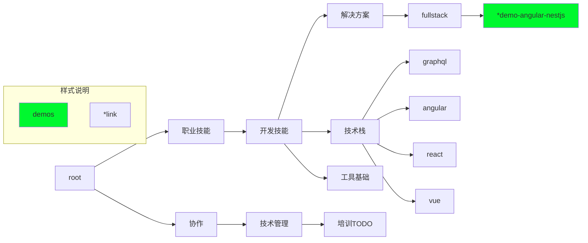

# skills

## test

```mermaid
flowchart LR

  classDef demo fill:#00f82f;
  subgraph 样式说明 
    ex-demo[demos]:::demo
    *link
  end
  

 
  root
  skills[职业技能]
  dev[开发技能]
  coo[协作]
  solution[解决方案]
  techstack[技术栈]
  tools[工具基础]

  root --> skills
  skills --> dev
  root --> coo

  dev --> solution
  dev --> tools
  dev --> techstack

  solution --> fullstack

  techstack --> graphql

  techstack --> angular
  techstack --> react
  techstack --> vue

  coo --> techmana[技术管理]

  techmana --> 培训TODO

  fullstack --> demo-angular-nestjs[*demo-angular-nestjs]
  demo-angular-nestjs:::demo
  click demo-angular-nestjs href "https://github.com/lovepocky-home/solution-fullstack-starter" "link"

```
