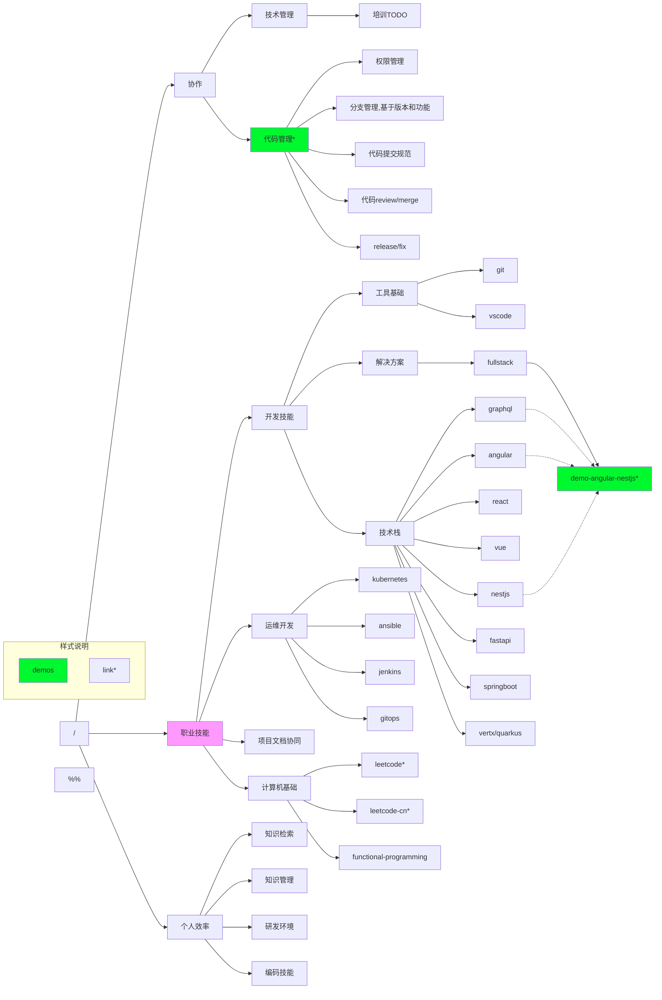

# skills

## 说明

目录的组织根据: 需求分类->落地方案(核心方案包括框架性的demo)

## 技能目录

链接地址

- demo-angular-nestjs: <https://github.com/lovepocky-home/solution-fullstack-starter>
- leetcode-cn: <https://leetcode-cn.com/u/lovepocky/>
- leetcode: <https://leetcode.com/lovepocky/>

## 协作开发流程

## 补充说明

### 个人效率

#### 编码技能

- vim + vscode
- tmux

## 其他知识点

- scala/spark
- js/ts
  - koa2
- docker/docker-compose
- elasticsearch
- redis
- mongodb
- mysql
